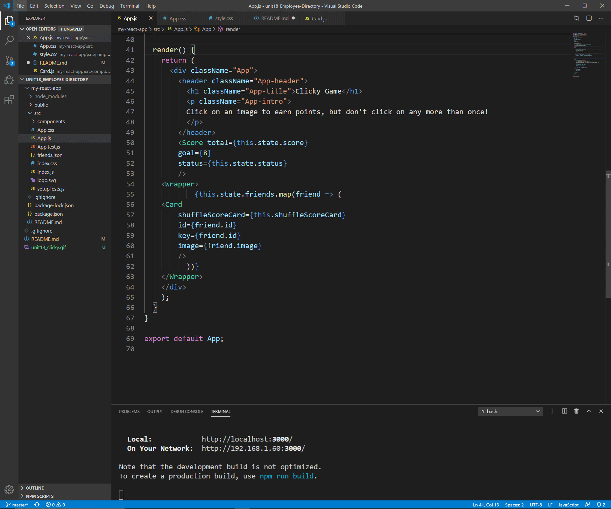

# Clicky Game

I created a memory game with React.  

## Code Snippets

Shows the render() function for game.

## Getting Started

To get started using the application, use any web browser to view live link, (https://itsmedexter.github.io/Clicky_Game_in_React/). Repository link, (https://github.com/itsmedexter/Clicky_Game_in_React).

## Technolgies Used

* [HTML](https://developer.mozilla.org/en-US/docs/Web/HTML)
* [CSS](https://developer.mozilla.org/en-US/docs/Web/CSS)
* [NodeJS](https://nodejs.org/en/)
* [React](https://reactjs.org/)

## Deployed Link

* [See Live Site](https://itsmedexter.github.io/Clicky_Game_in_React/)

## Authors

Dexter Valencia 

- [Link to Portfolio Site](https://github.com/itsmedexter/Clicky_Game_in_React)
- [Link to Github](https://github.com/itsmedexter)
- [Link to LinkedIn](https://www.linkedin.com/in/dextervalencia/)

## License

This project is licensed under the MIT License 

## Acknowledgments

* Thanks to everyone who helped me out!  
